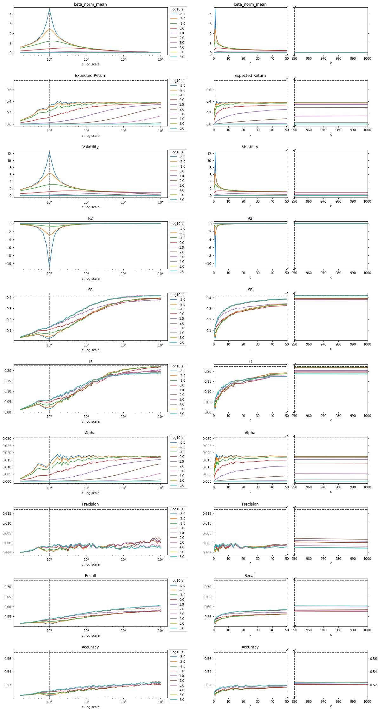
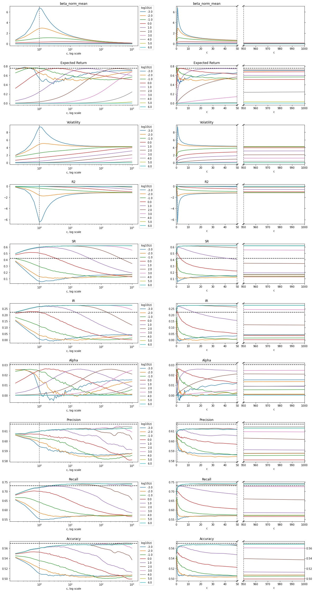
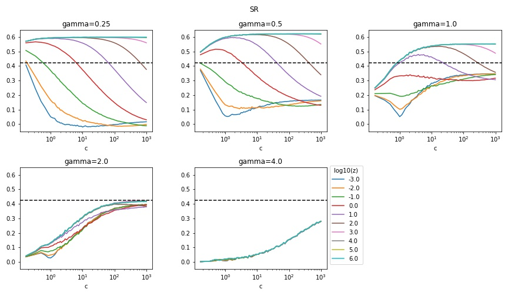
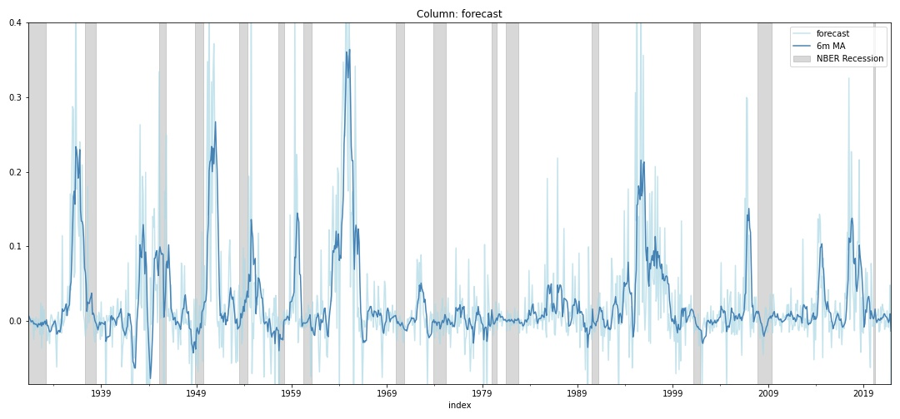
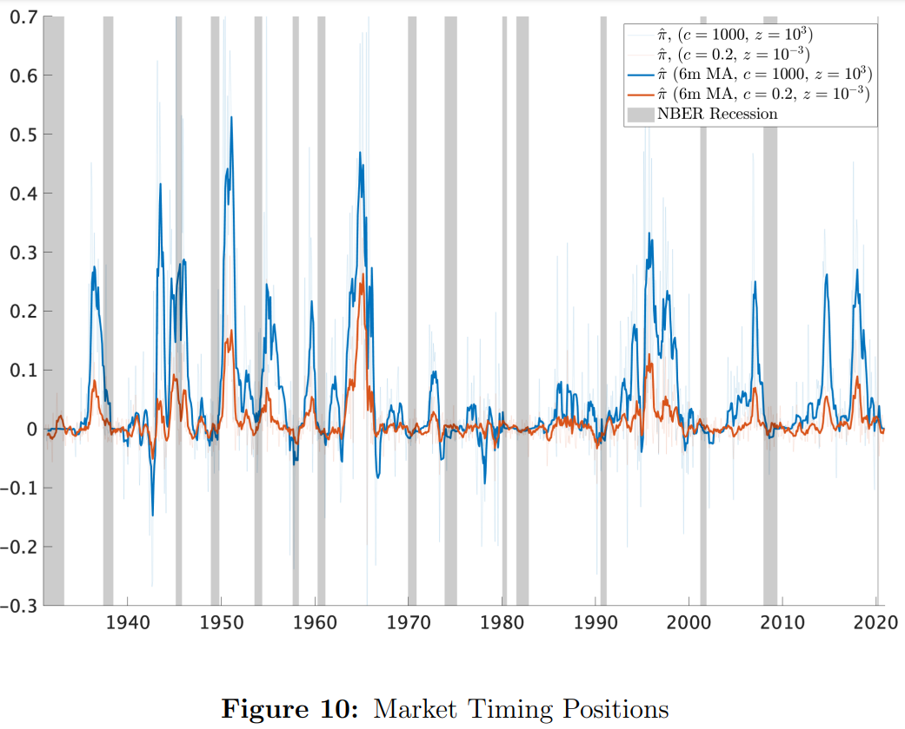

# replicating_the_virtue_of_complexity_in_machine_learning_portfolios
This repo is replicating the following paper:

**Kelly, Bryan T. and Malamud, Semyon and Zhou, Kangying**, *The Virtue of Complexity in Return Prediction*, December 2021, Swiss Finance Institute Research Paper No. 21-90. Available at SSRN: https://ssrn.com/abstract=3984925 or http://dx.doi.org/10.2139/ssrn.3984925.

> Contrary to conventional wisdom in finance, return prediction R2 and optimal portfolio Sharpe ratio generally increase with model parameterization, even when minimal regularization is used. We theoretically characterize the behavior of return prediction models in the high complexity regime, i.e. when the number of parameters exceeds the number of observations. Empirically, we document this "virtue of complexity" in US equity market prediction. High complexity models deliver economically large and statistically significant out-of-sample portfolio gains relative to simpler models, due in large part to their remarkable ability to predict recessions.

The dataset referenced in the paper is available at Amit Goyal's [webpage](https://sites.google.com/view/agoyal145/) and from his paper [A Comprehensive Look at the Empirical Performance of Equity Premium Prediction](https://drive.google.com/file/d/1uvjBJ9D09T0_sp7kQppWpD-xelJ0KQhc/view?usp=sharing) (with Ivo Welch), July 2008, Review of Financial Studies 21(4) 1455‒1508.

---


# Notes about the model - Ridge Regression with Moore-Penrose pseudo-inverse:

This is the formula from the paper. It has a run time of ~6mins for me.

> ```beta = np.linalg.pinv(z*np.identity(nr_cols) +  (S.T @ S)/T) @ (R @ S)/T```

Doing it with the normal inverse instead of the pseudo inverse has a run time of 25sec (not numerically stable if not full rank, numbers can get incredibly large).

>```beta = np.linalg.inv(z*np.identity(nr_cols) +  (S.T @ S)/T) @ (R @ S)/T```

*Note: I did not observe different results with inv() vs. pinv().*

This formula (notice that the division by `T` is missing) is equivalent to the sklearn ridge regression but orders of magnitude slower (*numpy: 6mins, Sklearn: 45ms*)
>```beta = np.linalg.pinv(z*np.identity(nr_cols) +  (S.T @ S)) @ (R @ S)```

We can adjust multiply Ridge.alpha with `T` to get full equivalence:

```
   np.linalg.pinv(z*np.identity(nr_cols) +  (S.T @ S)/T) @ (R @ S)/T
== np.linalg.pinv(z*np.identity(nr_cols)*T/T +  (S.T @ S)/T) @ (R @ S)/T
== np.linalg.pinv(T*z*np.identity(nr_cols) +  (S.T @ S))*T @ (R @ S)/T
== np.linalg.pinv(T*z*np.identity(nr_cols) +  (S.T @ S)) @ (R @ S)
```

Since the Sklearn solution is overall 8.000 times faster compared to the original formular, I will proceed with that solution. 
I did only test ~100 iterations in the comparision between `pinv()`, `inv()` and `Ridge()`.

# Result:

## Different metrics for a 1-step ahead prediction with 12 data points and gamma==2 and 0.5:
The baseline regression is indicated by a grey horizontal line. 
### Gamma == 2

### Gamma == 0.5


## Sharpe Ratio for different gamma:
The baseline regression is indicated by a grey horizontal line. 


## Market Timing positions vs NBER Recessions:
 
### Expected plot:
